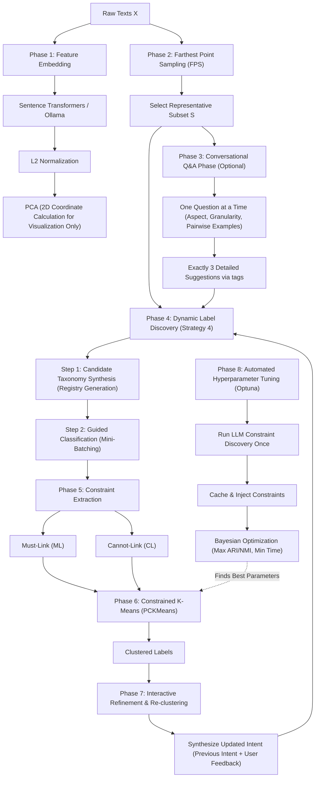

# C3 Framework: Conversational Constrained Clustering - End-to-End Workflow Specification

The Conversational Constrained Clustering (C3) framework is a decoupled, two-tier constraint-enforcement clustering system. It bridges natural language user intent and clustering algorithms by generating pairwise constraints via a Large Language Model (LLM) on a representative subset of data and running Pairwise Constrained K-Means (PCKMeans) on the full dataset.

---

## System Architecture

---

## Phase 1: Feature Embedding & Visualization Projection

### 1.1. Embedding Generation
Transform the raw text dataset $X$ (size $N$) into a continuous vector space.
* **Embedding Providers:** Supports local `SentenceTransformerEmbeddings` (defaulting to the highly efficient `all-MiniLM-L6-v2`) or local `OllamaEmbeddings`.
* **L2 Normalization:** Embedding vectors are L2-normalized to project them onto a unit hypersphere, making Cosine similarity mathematically equivalent to Euclidean distance calculations in later phases:
  $$\Phi(x) = \frac{x}{\|x\|_2}$$

### 1.2. VRAM & Hardware Optimization
When generating embeddings locally using PyTorch, batch sizes are configured to avoid Out-Of-Memory (OOM) errors:
* **Consumer-Grade GPUs (e.g., 6GB VRAM):** Batch size kept between `16` and `32`.
* **High-Performance GPUs (e.g., 16GB+ VRAM):** Batch size between `256` and `512`.

### 1.3. Visualization Projection (PCA)
Rather than executing metric learning or clustering on low-dimensional PCA coordinates, the pipeline clusters directly on the raw unit-normalized embeddings. Principal Component Analysis (PCA) is applied solely to project high-dimensional vectors to $2D$ coordinates for rendering inter-cluster scatter plots in the user interface.

---

## Phase 2: Farthest Point Sampling (FPS)

To explore the dataset boundaries and capture the data manifold geometrically without prior knowledge of the cluster structure, the system extracts a representative sample subset $S$ from the unit-normalized embeddings $\Phi(X)$.

### 2.1. Determine Sample Size
Calculate the sample size $n$ using a bounded proportional function:
$$n = \max\left(30, \min\left(\lfloor 0.02 \times N \rfloor, 150\right)\right)$$
This sample size can also be overridden via the explicit parameter `num_samples`.

### 2.2. Vectorized FPS Algorithm
Using NumPy/SciPy to perform vectorized computations, the system:
1. Initializes a distance array $D$ of size $N$ with $\infty$.
2. Chooses the first index randomly and appends it to the sampled list.
3. For each subsequent step until $n$ samples are collected:
   * Computes the squared Euclidean distance from the latest sampled point to all other points:
     $$D_{\text{new}}(i) = \|\Phi(x_i) - \Phi(x_{\text{latest}})\|_2^2$$
   * Updates the minimum distance to the sampled set:
     $$D(i) = \min(D(i), D_{\text{new}}(i))$$
   * Selects the next point maximizing this distance:
     $$\text{idx} = \arg\max_i D(i)$$
   * Adds $\text{idx}$ to the sampled list.

---

## Phase 3: Conversational Q&A Phase (Optional)

Before initiating classification, the system can run a turn-based Q&A interview to align the agent with the user's intent.

### 3.1. Dialogue Structure
To prevent overwhelming the user, the dialog phase follows strict rules:
* **One Question at a Time:** The agent asks exactly one question per turn.
* **Probing Sequence:**
  1. **Aspect:** Clarifies which semantic dimension the user wants to group by.
  2. **Granularity:** Identifies how detailed or general the categories should be.
  3. **Pairwise Preferences:** Presents actual pairs of sampled documents and asks whether they should belong to the same cluster or separate clusters.
* **3 Suggestions Output:** Each question must be accompanied by exactly 3 detailed, clickable suggestions formatted inside `[SUGGESTIONS] ... [/SUGGESTIONS]` tags.

---

## Phase 4: Dynamic Sequential Label Discovery

The system employs **Strategy 4: Two-Step Guided Label Discovery** using the LLM clustering agent.

### 4.1. Step 1: Candidate Taxonomy Synthesis
Before classifying individual documents, the LLM is given a list of representative documents (generated via FPS) and the user's intent:
* It designs a draft candidate registry of categories dynamically based on the semantic variation in the data.
* Category descriptions are stored in the global registry:
  $$\text{Registry} = \{\text{"Cluster\_ID"}: \text{"English Description of Topic"}\}$$

### 4.2. Step 2: Guided Classification
The remaining documents to be discovered are divided into mini-batches (e.g. size 100).
* The LLM classifies each document into an existing cluster in the registry.
* If a document does not fit any existing category, the LLM is allowed to create a new cluster ID (e.g. `Cluster_X`), define its description, and assign the document.
* Any newly created clusters are merged back into the global registry.

---

## Phase 5: Pairwise Constraint Extraction

The assignments discovered on the representative sampled subset $S$ are expanded into constraint sets to guide the partition solver.

### 5.1. Pairwise Combinatorics
For every pair of items $(x_i, x_j) \in S$, comparison of their assigned labels yields constraints:
* **Must-Link ($M_t$):** Assigned if both items are classified under the same cluster ($l_i = l_j$).
* **Cannot-Link ($C_t$):** Assigned if they belong to different clusters ($l_i \neq l_j$).

---

## Phase 6: Pairwise Constrained K-Means (PCKMeans)

The full dataset is partitioned into $K$ clusters by applying PCKMeans directly on the raw unit-normalized embeddings using the extracted constraints.

### 6.1. Target Cluster Count (K)
The number of target clusters $K$ is determined in one of two ways:
* **Explicit $K$:** If the constructor parameter `n_clusters` is explicitly provided (or specified via the dataset prompts), the pipeline overrides LLM category counts and runs PCKMeans with the targeted $K$.
* **Discovered $K$:** If no target $K$ is provided, the pipeline sets $K$ to the count of unique categories found in the global registry.

### 6.2. Objective Function
PCKMeans minimizes the standard K-Means objective modified to penalize constraint violations:
$$J = \sum_{i=1}^N \|x_i - \mu_{l_i}\|_2^2 + w \left( \sum_{(i,j) \in M_t} \mathbb{I}(l_i \neq l_j) + \sum_{(i,j) \in C_t} \mathbb{I}(l_i = l_j) \right)$$
* **Constraint Propagation:** Must-Link constraints are propagated transitively using a Union-Find data structure to group items into connected constraint components.
* **Parameters:** Tuned via penalty weight $w$, maximum iterations, and convergence tolerance.

---

## Phase 7: Interactive Refinement & Re-clustering

When the user provides corrective feedback or instructions during subsequent chat turns:
1. **Intent Synthesis:** The LLM agent takes the previous clustering intent and the user's new feedback to synthesize a new, unified, and highly cohesive clustering intent description.
2. **Re-run from Scratch:** The pipeline resets all current cluster labels, clears the assignments, and re-runs the dynamic label discovery and PCKMeans loops from scratch under the updated intent. This guarantees that new ideas are fully integrated across the entire dataset structure.

---

## Phase 8: Automated Hyperparameter Optimization (Optuna)

The framework includes `scripts/optimize_hyperparameters.py` to search for optimal clustering hyperparameter values.

### 8.1. Hyperparameter Search Space
* `pck_w`: Float weight penalty for violating constraints ($0.1$ to $100.0$).
* `pck_max_iter`: Integer maximum clustering iterations ($20$ to $300$).
* `pck_tol`: Log-Float convergence tolerance ($10^{-6}$ to $10^{-2}$).

### 8.2. High-Efficiency Constraint Caching
Optuna runs multiple trials without incurring high network delays and API costs:
1. **Single-Run LLM Querying:** The pipeline runs the FPS and label discovery phases once using a real LLM agent.
2. **Constraint Caching:** The resulting sample indices, assignments, and constraints are cached.
3. **Trial Injection:** For each Optuna trial, the pipeline is instantiated *without* an LLM agent, the cached constraints are injected into the state, and only PCKMeans is executed. This reduces trial evaluation time to **~0.3–3.0 seconds per trial**.